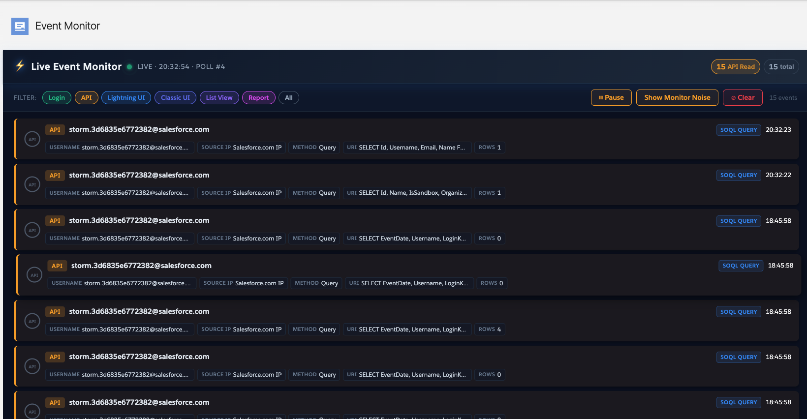

# Salesforce Event Monitor

A Lightning Web Component (LWC) for real-time monitoring of Salesforce Shield Event Monitoring data. Visualize login events, API calls, UI activity, and more as they happen.

## Features

- **Real-Time Event Streaming** — Polls Event Log Objects every 5 seconds
- **Multi-Event Support** — LoginEvent, ApiEvent, LightningUriEvent, UriEvent, ListViewEvent, ReportEvent
- **Origin Detection** — Identifies Agentforce, MCP, CLI, Browser, and other sources
- **Operation Tagging** — Color-coded read/write operations
- **Session Correlation** — LoginKey, SessionKey, LoginHistoryId for tracing
- **Filtering** — Filter by event type, hide monitor noise
- **Pause/Resume** — Freeze the display while investigating
- **Detail Modal** — Click any event for full payload inspection

## Screenshot



## Architecture

```
┌─────────────────┐      ┌─────────────────┐      ┌─────────────────┐
│  streamingMonitor │ ──▶ │ EventMonitor    │ ──▶ │  Real-Time      │
│  (LWC)          │      │ Controller      │      │  Event Objects  │
└─────────────────┘      │ (Apex)          │      │  (Big Objects)  │
                         └─────────────────┘      └─────────────────┘
```

### Supported Events

| Event Type | What It Captures | Color |
|------------|------------------|-------|
| `LoginEvent` | User logins, OAuth flows, session starts | Green |
| `ApiEvent` | REST/SOAP API calls, SOQL queries | Yellow (read) / Red (write) |
| `LightningUriEvent` | Lightning Experience page views | Blue |
| `UriEvent` | Classic UI page views | Indigo |
| `ListViewEvent` | List view access | Purple |
| `ReportEvent` | Report execution | Fuchsia |

### Origin Detection

The monitor identifies the source of each event:

| Origin | Detection Method |
|--------|------------------|
| **Agentforce** | `BotId` field populated |
| **MCP Gateway** | `SourceIp = 3.234.75.13` or app name pattern |
| **SF CLI** | Client string contains `sfdx`, `sf-cli` |
| **Browser** | Standard Lightning/Classic UI events |
| **OAuth App** | `LoginType = Remote Access 2.0` |

## Prerequisites

- **Salesforce Org** with Shield Event Monitoring or Event Monitoring add-on
- **User Permission**: "View Real-Time Event Monitoring Data"
- **Salesforce CLI** (`sf`) for deployment

## Installation

### 1. Clone the Repository

```bash
git clone https://github.com/gyantsos123/salesforce-event-monitor.git
cd salesforce-event-monitor
```

### 2. Authenticate to Your Org

```bash
sf org login web -a my-org
```

### 3. Deploy to Salesforce

```bash
sf project deploy start --target-org my-org
```

### 4. Add to Lightning Page

1. Go to **Setup** → **Lightning App Builder**
2. Edit your desired Lightning page (Home, App Page, etc.)
3. Drag the **Streaming Monitor** component onto the page
4. Save and activate

## Component Reference

### streamingMonitor (LWC)

The main monitoring interface.

**Features:**
- Auto-polls every 5 seconds
- Configurable event type filters
- Clear/Show History toggle
- Pause/Resume functionality
- Click-to-inspect event details

### EventMonitorController (Apex)

Backend controller that queries Real-Time Event Monitoring objects.

**Queried Fields (ApiEvent):**
- `EventIdentifier`, `EventDate`, `Username`, `SourceIp`
- `Operation`, `Query`, `RowsProcessed`, `QueriedEntities`
- `Client`, `BotId`, `ConnectedAppId`
- `LoginHistoryId`, `LoginKey`, `SessionKey` (session correlation)
- `OperationStatus`, `Records` (query results)

**Queried Fields (LoginEvent):**
- `EventIdentifier`, `EventDate`, `Username`, `SourceIp`
- `LoginType`, `LoginSubType`, `Status`, `Browser`, `Platform`
- `Application`, `LoginHistoryId`, `LoginKey`, `SessionKey`
- `PolicyOutcome`, `TlsProtocol`

## Observability Notes

### What You Can See

- ✅ All user logins (LoginEvent)
- ✅ Direct API calls via Connected Apps
- ✅ Agentforce activity (BotId populated)
- ✅ CLI operations
- ✅ UI page views

### Known Gaps (ECA/MCP)

- ⚠️ MCP-routed queries do **not** fire `ApiEvent`
- ⚠️ ECA/JWT logins appear in `LoginEvent` but API activity is limited
- ⚠️ Activity is captured in daily EventLogFile CSVs but not real-time ELOs

> For full MCP observability, download and analyze EventLogFile CSVs (`RestApi`, `ApiTotalUsage` event types).

## Project Structure

```
salesforce-event-monitor/
├── force-app/
│   └── main/default/
│       ├── lwc/
│       │   ├── streamingMonitor/     # Main monitor component
│       │   ├── eventTimeline/        # Timeline visualization
│       │   └── streamingUtility/     # Shared utilities
│       └── classes/
│           ├── EventMonitorController.cls      # Main controller
│           └── EventTimelineController.cls     # Timeline controller
├── sfdx-project.json
└── README.md
```

## Customization

### Change Poll Interval

In `streamingMonitor.js`, modify `POLL_INTERVAL`:

```javascript
const POLL_INTERVAL = 5000; // milliseconds
```

### Add New Event Types

1. Add channel config in `CHANNEL_CONFIG`
2. Create query method in `EventMonitorController.cls`
3. Add to `getRecentEvents()` results

## Troubleshooting

### "No events appearing"

1. Verify user has "View Real-Time Event Monitoring Data" permission
2. Check that Event Monitoring is enabled in your org
3. Generate some activity (login, run a query) to create events

### "Events delayed"

Real-Time Event Monitoring has inherent latency (up to 15-30 minutes for some event types). The controller looks back 90 minutes to catch delayed events.

### "RowsProcessed shows scientific notation"

Fixed in latest version — `RowsProcessed` is now converted to Integer before display.

## License

MIT

## Contributing

Pull requests welcome! Please open an issue first to discuss proposed changes.

---

Built for Salesforce Shield Event Monitoring observability.
